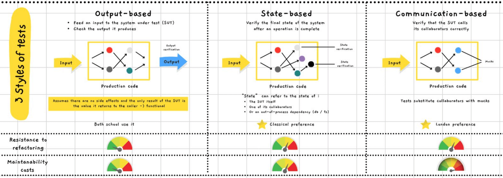

# Bowling kata - React
A simple kata about implementing a bowling score calculator while practicing TDD.

In addition to TDD, you may also:
 * Try [enzyme](https://enzymejs.github.io/enzyme/), see what shallow rendering can give you. You may also test the [state evaluation](https://enzymejs.github.io/enzyme/docs/api/ReactWrapper/state.html) functionality, but be mindful of your [test's robustness](https://medium.com/wesionary-team/react-testing-library-vs-enzyme-afd29db380ac)
[[]](https://twitter.com/yot88/status/1450435942460928000?cxt=HHwWgMC9_cHz_aAoAAAA)
* Try some [BDD](https://lizkeogh.com/2012/06/01/bdd-in-the-large/) formatted test, with [Chai](https://www.chaijs.com/), either in should or expect style. You can event apply it to [enzyme](https://www.npmjs.com/package/chai-enzyme)!
* You may apply a little bit of DDD, separating the UI from your domain
  

Adaptation / update from [Erlend Vestad](https://github.com/erlendve/react-bowling-kata)'s version for the kata

## How To
To help you to write your test, you may use an [existing calculator](https://www.bowlinggenius.com/) to ensure that you have the correct score for a game.

At first, you may only display a total score when the game is complete.

**The rules are as follows :**
* A game has 10 rounds
* Each round, the player has 2 throws to make all 10 pins fall
* The score of a round is the total number of fallen pins, plus bonus for spares and strikes
* A spare is when a player hit all 10 pins in two throws in the same round
* The bonus for a spare is the number of fallen pins in the next throw
* A strike hit all 10 pins in the first throw of a round. There is no second throw for this turn
* The bonus for a strike is the number of fallen pins of the next 2 throws
* In the last (10th) turn, the player can do additional throws in order to complete the bonus if he performs a spare or a strike. So this turn may contain 3 throws
* A perfect game - only strikes - as a total score of 300 points

## Available Scripts
### `npm start`

Runs the app in the development mode.\
Open [http://localhost:3000](http://localhost:3000) to view it in your browser.

The page will reload when you make changes.\
You may also see any lint errors in the console.

### `npm test`

Launches the test runner in the interactive watch mode.\
See the section about [running tests](https://facebook.github.io/create-react-app/docs/running-tests) for more information.
